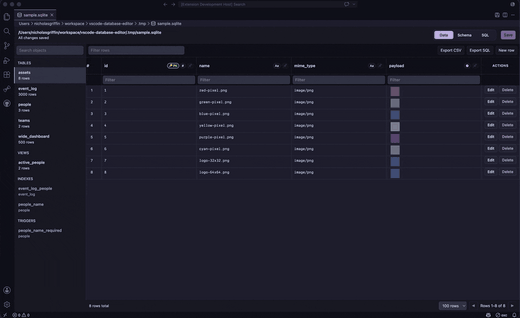
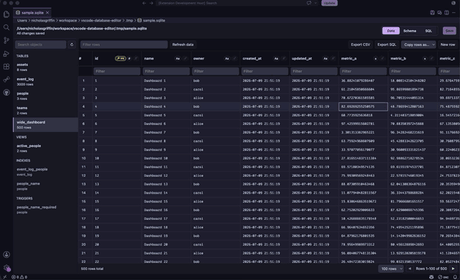

# Database Editor for VS Code

A fast, lightweight SQLite database editor built directly into VS Code. Browse tables, edit data, run queries, and manage your database schema — all without leaving the editor.

## Features

- **Open any SQLite file** — Supports `.db`, `.db3`, `.sqlite`, `.sqlite3`, `.sdb`, `.s3db`, and `.gpkg` files
- **Browse database structure** — Tables, views, indexes, triggers, columns, primary and foreign keys in a clean sidebar
- **Paged data grid** — Sort, filter, and paginate through table data with per-column search
- **Inline editing** — Click any cell to edit its value, add new rows, or delete existing ones
- **Image preview** — BLOB columns with PNG/JPEG/GIF/WebP images render as thumbnails inline
- **Pin rows & columns** — Pin important columns to the left and mark rows for easy reference
- **VS Code save integration** — Edits are tracked and saved using the normal `Ctrl+S` / `Cmd+S` flow with undo/redo support
- **Schema management** — Create, rename, and drop tables; add and remove columns
- **SQL query tab** — Run read-only SQL queries with a full result grid
- **Export** — Export visible rows as CSV, or dump schema and table data as SQL
- **Pure client-side** — Powered by [`sql.js`](https://github.com/sql-js/sql.js) (SQLite compiled to WebAssembly) — no native dependencies

## Usage

1. Open any SQLite database file (`.db`, `.sqlite`, etc.) in VS Code.
2. The custom editor launches automatically — browse tables in the sidebar.
3. Click a table to view its data in the paged grid.
4. Click any cell to edit its value, or use the Actions column to add/delete rows.
5. Press `Ctrl+S` (`Cmd+S` on macOS) or click the Save button to persist changes.

### GitHub Copilot integration

When GitHub Copilot Chat is installed, use `@sqlite`, its `/schema`, `/query`, `/explain`, and `/profile` commands, or the “Chat with SQLite Database” editor action. The participant keeps recent conversation turns and receives privacy-safe editor context: the active database, selected table/view, filters, and sort state. Grid row values are never included in that automatic context.

Copilot tools can:

- List open databases and require an explicit `databaseUri` whenever more than one is open.
- Return a paginated schema summary or focused columns, keys, indexes, triggers, and CREATE SQL for the selected object.
- Run validated `SELECT`/safe `WITH` queries with cancellation, a configurable time budget, and a configurable row cap.
- Run grounded `EXPLAIN QUERY PLAN` analysis and aggregate table profiling without returning sample rows.
- In read/write mode, apply one confirmed modification or an atomic, confirmed multi-statement migration through the editor's dirty/save/undo history.

The integration has two access modes:

- **Read-only (`ro`)** — The default. Copilot can inspect schema and run validated read-only query and analysis tools. It cannot run `INSERT`, `UPDATE`, `DELETE`, DDL, `PRAGMA`, `ATTACH`, `VACUUM`, or scripts.
- **Read/write (`rw`)** — Enables confirmed modification and migration tools. Confirmations identify the target database and preview the SQL. Successful changes refresh the webview, mark the document dirty, and can be saved, undone, or redone normally.

### Copilot privacy and limits

Query rows are processed inside the extension host and sent to the language model only when a query tool is used. Columns matching `databaseEditor.copilot.sensitiveColumnPatterns` are replaced with `[REDACTED]` before tool results are returned. Defaults cover common password, token, secret, API-key, and SSN names. This name-based redaction is a safeguard, not a substitute for reviewing database contents before granting Copilot access.

- `databaseEditor.copilot.enable` hides the participant and tools and also blocks tool invocation at runtime.
- `databaseEditor.copilot.accessMode` controls read-only versus confirmed read/write access.
- `databaseEditor.copilot.maxResultRows` controls the query response cap (default 200, maximum 500).
- `databaseEditor.copilot.queryTimeoutMs` controls the soft query/analysis time budget (default 5000 ms).
- `databaseEditor.copilot.sensitiveColumnPatterns` configures case-insensitive regular expressions used for value redaction.

SQLite runs in-process, so cancellation and timeout checks occur between SQLite result steps; they cannot interrupt a single long native/WASM step. Set `databaseEditor.copilot.accessMode` to `rw` only when you intend to review and confirm database changes.

## Requirements

- VS Code 1.125.0 or later
- No external dependencies — SQLite runs entirely in the webview via WebAssembly

## Known Limitations

- Only SQLite databases are supported (other SQL databases planned for future releases)
- The SQL query tab only allows `SELECT` statements (data editing is done through the grid)

## License

Apache 2.0 — see [LICENSE](LICENSE) for details.
